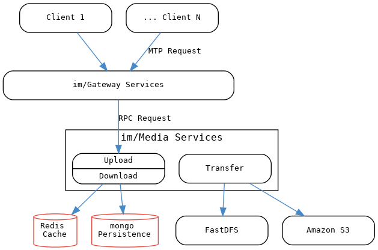
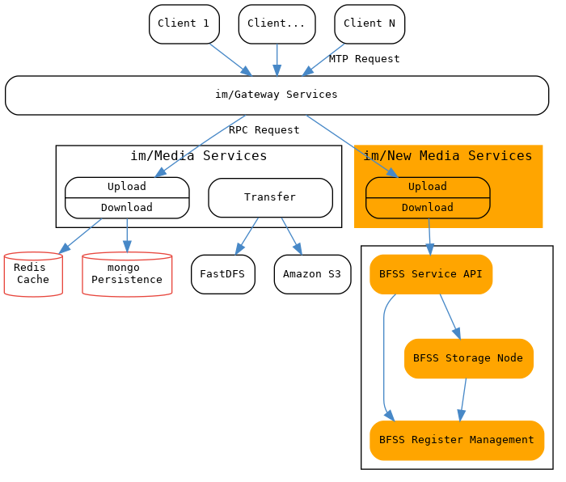
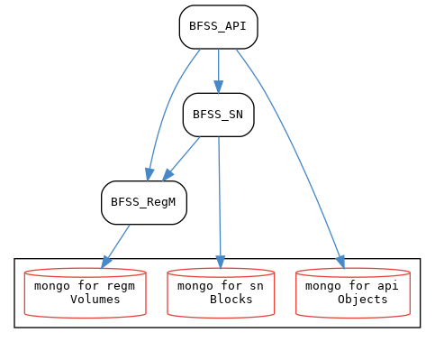
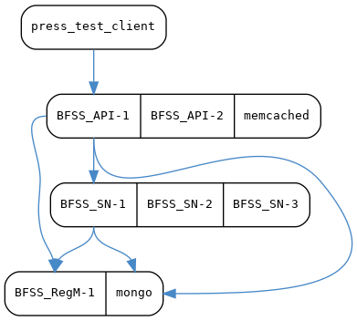

# 存储服务现状
## 服务架构


### 说明
1. mongo 管理fid-s3 &fid-ffid 的映射信息，通过fid可以获取S3上的数据和获取FastDF上的数据。
2. redis 管理文件碎片。
3. transfer负责即将redis中的数据搬迁到S3和FastFDS。
4. upload & download服务，统称为媒体服务。

## 时序图
### 上传

### 下载


# 应用BFSS后的服务架构
## 服务架构


## 说明
1、原有的服务组件不动，与原有的媒体服务对应的新开一个独立服务。
2、im/Gateway 需要能够分发RPC到新的媒体服务：以oid/fid区分，老的文件走原有的媒体服务。
3、新的媒体服务对接BFSS。


# BFSS UserCase


## 用户上传文件(对象)

1. 创建文件(对象)
2. 写入文件(对象)
3. 写入完成
4. 特殊场景：更新文件(对象)大小

oid/fid会出现在mtp消息里，只是用户不可见。

  详见 [CreateObject](#);
## 用户获取文件(对象)

### 用户通过媒体服务直接获取非加密的文件(对象)

### 用户通过HTTP(CDN)获取加密的数据

1. 获取文件(对象) 块信息和块密钥
2. 依据块信息，获取加密数据，用块密钥解密


## 用户删除文件(对象)


# BFSS内部架构



## BFSS 关键设计
- 安全设计
  - 块设备中始终存放加密后的数据。
  - 每块一个独立的密钥，按块加密。 
- 数据库设计
  - API服务通过ObjectDb.ObjectCol管理文件（对象）的索引信息，关键信息是oid->(VolumeID+BeginIndex+BeginOffset+Size)；
  通过ObjectDb.ObjectHashCol管理文件（对象）的Hash信息，关键信息是hash+head+size->set(oid)。
  - RegM通过VolumeDb.VolumeChipCol管理各个节点的碎片信息；通过VolumeDb.VolumeCol管理各个节点的剩余空间。
  - API调用RegM获得oid的(VolumeID+BeginIndex+BeginOffset+Size)。但是RegM内部并不记录oid的信息。
  - SN节点通过BKeyDb.BKeyCol管理各个块的密钥。但是SN并不知道oid的任何信息。
- 碎片管理
  - 只有删除没有写完成的文件（对象），才会产生碎片。
  - 已经完成的对象，删除操作只是删除了ObjectDb.ObjectCol中的索引信息；文件实体和ObjectDb.ObjectHashCol管理文件（对象）的Hash信息都留下来。
  - 每个文件（对象）始终分配到一个连续的空间。
  - 产生碎片会进行碎片合并，会将两块相邻或三块(中间)相邻数据合并成一块整的数据。
- SN缓存设计
  - 写数据时，在SN存储节点内部，数据需要经过C(D)解密的cache块和C(E)加密的cache块，才能写入实际的块设备B： S -> C(D) -> C(E) -> B。
  - 读数据时，与写相反，B -> C(E) -> C(D) -> S。
  - cache是一片连续的内存，与存储节点里的块对应，cache也被划分成5M一块。
  - 现在使用数组管理cache空间，C(E) & C(D)始终成对出现。对块ID求模就得到cache索引，判断cache中的块ID是不是与请求的块ID一致，决定是不是需要落盘或者读盘。
  - 后续可以根据实际情况，考虑要不要优化，比如把数组改成链表。可以按照最近访问的原则替换很久没有使用的cache节点。
- 文件去重设计
  - hash+head+size 三个条件是判断一个文件（对象）是否重复的依据。
  - 删除已经完成的文件（对象），并不会删除磁盘中的文件。
  - 小文件可以在客户端先完成hash计算，在hash校验，没有则CreateObject+Write+WriteComplete，否则，只需要CreateObjectLink即可完成写入。
  - Hash也可以认为是校验文件写入完整性的依据。
- SN主备节点设计
  - SN节点的配置中标注好自己是主节点还是备节点；VolumeID一样，IP不一样。
  - SN主节点里会完成对备节点的写操作的同步。主节点才有向RemM注册的义务。
  - RegM中为文件（对象）分配空间时，必须有主备，才能分配空间。
  - API服务感知不到SN主备节点，主备不全时，RegM不会对该VolumeID分配空间，也就不会有写操作。
  - API服务写操作失败，则会删除缓存的VolumeID对应节点的IP，下次访问VolumeID，重新从RegM中获取VolumeID对应的节点IP。
  - API服务读操作失败，也会删除缓存的VolumeID对应节点的IP。
  - SN主备节点的差异：硬件性能差异，备节点CPU、内存配置可以比主节点低，存储空间必须一致。
  - 正常的服务启动顺序 RegM服务 -> SN服务(主节点) -> SN服务(备节点) -> API服务。
  - 


## BFSS 部署示例


### 说明（要求）
1. 一个服务器，部署两个API （在一个机器上启动两个应用实例，并将memcache部署在一起）。
   > 要求：不低于32G内存；磁盘空间可以20G。
2. 三个服务器，部署三个SN存储节点  -- 分别部署在两个机器上（每个节点都需要使用独立的内存作为缓存）。
   > 要求：不低于32G内存；不低于 1T  磁盘空间。
3. 一个服务器，部署一个RegM节点 （并部署mongodb）
   > 要求：不低于32G内存；不低于100G磁盘空间。
4. 一个压测服务器，部署压测客户端程序。
   > 要求：不低于8G内存；不低于100G磁盘空间。
5. 服务器网络配置要求：万兆网卡。
6. 部署mongodb   （与RegM部署在同一台机器上）。
7. 部署mecached  （与API部署在同一台机器上）。


### 测试环境 
```
ssh root@10.0.1.181 8G  60G
ssh root@10.0.1.182 8G  60G+1T      SN
ssh root@10.0.1.183 8G  60G+1T      SN
ssh root@10.0.1.184 8G  60G+1T      SN
ssh root@10.0.1.185 32G 200G        REGM
ssh root@10.0.1.186 16G 100G        API

scp ./BFSS.tar.gz root@10.0.1.181:/home/bfss
scp ./BFSS.tar.gz root@10.0.1.182:/home/bfss
scp ./BFSS.tar.gz root@10.0.1.183:/home/bfss
scp ./BFSS.tar.gz root@10.0.1.184:/home/bfss
scp ./BFSS.tar.gz root@10.0.1.185:/home/bfss
scp ./BFSS.tar.gz root@10.0.1.186:/home/bfss


scp root@10.0.1.185:/home/bfss/bfssproject/out/bin/BFSS_APID ./
scp root@10.0.1.185:/home/bfss/bfssproject/out/bin/BFSS_SND  ./
scp root@10.0.1.185:/home/bfss/bfssproject/out/bin/BFSS_REGMD  ./

scp root@10.0.1.185:/home/bfss/bfssproject/out/bin/BFSS_* ./
scp root@10.0.1.185:/home/bfss/bfssproject/TestCase/bin/BFSS_* ./

scp ./BFSS_REGMD root@10.0.1.185:/home/regm/
scp ./BFSS_APID root@10.0.1.185:/home/api/
scp ./BFSS_APID root@10.0.1.186:/home/api1/
scp ./BFSS_APID root@10.0.1.186:/home/api2/
scp ./BFSS_SND  root@10.0.1.182:/home/sn/
scp ./BFSS_SND  root@10.0.1.183:/home/sn/
scp ./BFSS_SND  root@10.0.1.184:/home/sn/

scp ./BFSS_API_Test root@10.0.1.181:/home/bfss/tests/

```


####编译环境安装

```
systemctl start redsocks
iptables-restore < /home/st/iptables.ini 

yum install centos-release-scl
yum install devtoolset-7-gcc-c++
scl enable devtoolset-7 bash

yum install openssl-devel 
yum install patch
yum install zip unzip wget lrzsz epel-release
yum install libevent-devel zlib-devel openssl-devel python-devel
yum install ipvsadm
yum install centos-release-scl
yum install devtoolset-7-gcc-c++
yum install libtool
yum install byacc
yum install flex bison
yum install boost boost-thread boost-devel
yum install libtool perl-core zlib-devel


mkdir build; cd build
cmake -DCMAKE_BUILD_TYPE=Debug ..
cmake -DCMAKE_BUILD_TYPE=Release

```

#### 部署时的*.so依赖
```
mkdir lib
mkdir lib64
mkdir -p ./apr/lib
cp /usr/local/lib/libthrift-0.12.0.so ./lib
cp /usr/local/lib/libconfig++.so.9 ./lib
cp /usr/local/lib/libthriftnb-0.12.0.so ./lib
cp /usr/local/lib/liblog4cxx.so.10 ./lib
cp /usr/local/lib/libmemcached.so.11 ./lib
cp /usr/local/lib/libboost_serialization.so.1.60.0 ./lib
cp /usr/local/lib/libboost_system.so.1.60.0 ./lib
cp /usr/local/lib/libboost_thread.so.1.60.0 ./lib

cp /usr/local/apr/lib/libaprutil-1.so.0 ./apr/lib
cp /usr/local/apr/lib/libapr-1.so.0 ./apr/lib

cp /usr/local/lib64/libmongocxx.so._noabi ./lib64
cp /usr/local/lib64/libbsoncxx.so._noabi ./lib64
cp /usr/local/lib64/libmongoc-1.0.so.0 ./lib64
cp /usr/local/lib64/libbson-1.0.so.0 ./lib64

cp -f ./lib/* /usr/local/lib/
cp -f ./lib64/* /usr/local/lib64/
cp -f ./apr/lib/* /usr/local/apr/lib/
```


测试时清空数据，执行如下命令：
```
mongo 10.0.1.185
use BKeyDb
db.dropDatabase()
use ObjectDb
db.dropDatabase()
use VolumeDb
db.dropDatabase()

```
```
telnet 10.0.1.186 11211
flush_all

```


性能分析
```
gprof ./BFSS_SND | gprof2dot > BFSS_SND.dot
gprof ./BFSS_SND | ./gprof2dot.py > BFSS_SND.dot

dot -Tsvg -o BFSS_SND.svg BFSS_SND.dot

```


## BFSS外部接口说明
### BFSS_API

### CreateObject
### 
### 

## BFSS内部接口说明
### BFSS_REGM

### 
### 

### BFSS_SN

### 
### 
### 


```

性能/压力测试 希望看到的指标
1、 作为BFSS API的客户端，需要知道 持续写入不同大小文件的 响应时延：
举例： 
连续写入100K以下的文件，写满10G/50G/或者更大空间的总耗时。
连续写入100K～1M的文件，写满10G/50G/或者更大空间的总耗时。
连续写入1～5M的文件，写满10G/50G/或者更大空间的总耗时。
连续写入5～10M的文件，写满10G/50G/或者更大空间的总耗时。
连续写入10～100M的文件，写满10G/50G/或者更大空间的总耗时。
...

2、作为BFSS API的客户端，需要知道 记录持续写入不同大小文件的 延时变化情况（稳定性）：

反复多次写入类似的数据, 在不同客户端链接数量下 的耗时变化情况。
举例： 
启动1个客户端  记录每个客户端上 每个文件写入完成的时间，最终用于绘制时间曲线。
启动5个客户端  记录每个客户端上 每个文件写入完成的时间，最终用于绘制时间曲线。
启动10个客户端  记录每个客户端上 每个文件写入完成的时间，最终用于绘制时间曲线。
直到找出某个临界点，表现为客户端写入明显变慢。

上述要求，都是客户端能观测的性能： 最大并发客户端链接数量、不同链接数量下的 单客户端 单位时间的吞吐量、平均延时。

服务器端的性能（如内部三个服务的CPU和内存消耗），需要使用性能监控工具或者API Service内部添加监控接口才能产生性能数据。


```


